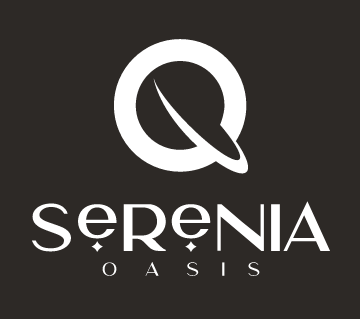

# Sistema web - Hotel Serenia Oasis




## 📋 Índice

- [Descripción del proyecto](#descripción-del-proyecto)
- [Estado del proyecto](#estado-del-proyecto)
- [Características de la aplicación y demostración](#características-de-la-aplicación-y-demostración)
- [Acceso al proyecto](#acceso-al-proyecto)
- [Tecnologías utilizadas](#tecnologías-utilizadas)
- [Personas Desarrolladores del Proyecto](#personas-desarrolladores)
- [Licencia](#licencia)
- [Conclusión](#conclusión)

## 📖 Descripción del proyecto

Este proyecto es una implementación de una base de datos para la gestión de reservas del Hotel Serenia Oasis. El sistema está desarrollado utilizando PHP, MySQL, HTML y CSS. Además, se utiliza SweetAlert para manejar las alertas en la interfaz del usuario. El hotel cuenta con 12 habitaciones, distribuidas entre individual, doble y matrimonial con sus precios ya establecidos. Como tambien, cuenta con servicios ya establecidos del hotel.

## 🔍 Estado del proyecto


El proyecto está actualmente en desarrollo. Se están añadiendo nuevas funcionalidades y mejorando las existentes.

## ✨ Características de la aplicación y demostración

### 🔑 Loguin


### 🏠 Panel Principal


### 👤 Personal

- **Gestión de Clientes**: Permite agregar, modificar y eliminar información de clientes.


- **Gestión de Habitaciones**: Permite modificar el estado de la habitacion.


- **Gestión de Reservas**: Permite agregar y eliminar reservas.


- **Gestión de Servicios Adicionales**: Permite agregar, modificar y eliminar información de los servicio adicionales.


  
- **Gestión de Transacciones**: Permite agregar, eliminar y imprimir información de transacciones.


### 👔 Administrador

- **Las mismas funcionalidades**

- **Gestión de Personal**: Permite agregar, modificar y eliminar información del personal.


## 🔗 Acceso al proyecto

1. Clona el repositorio:
   
   ```bash
   git clone https://github.com/JSobero/Hotel-Tesina.git

2. Al momento de loguearte ingresa con el usuario "admin" y la clave "123456" .

## 💻 Tecnologías utilizadas

* 
* 
* 
* 
* 

## 👥 Personas Desarrolladores del Proyecto

* Joaquin Pomayay - Proyecto - [JSobero](https://github.com/JSobero)

## 📝 Conclusión

El proyecto "Sistema web - Hotel Serenia Oasis" está diseñado para facilitar la gestión integral de un hotel, abarcando desde la administración de clientes y habitaciones hasta las reservas y servicios adicionales. Utilizando tecnologías como PHP, MySQL, HTML, CSS y SweetAlert, este sistema busca optimizar las operaciones diarias del hotel, mejorar la eficiencia del personal y proporcionar una experiencia fluida para los usuarios. Aunque el proyecto está en desarrollo, su enfoque en la usabilidad y funcionalidad promete convertirse en una herramienta esencial para la administración del Hotel Serenia Oasis.
